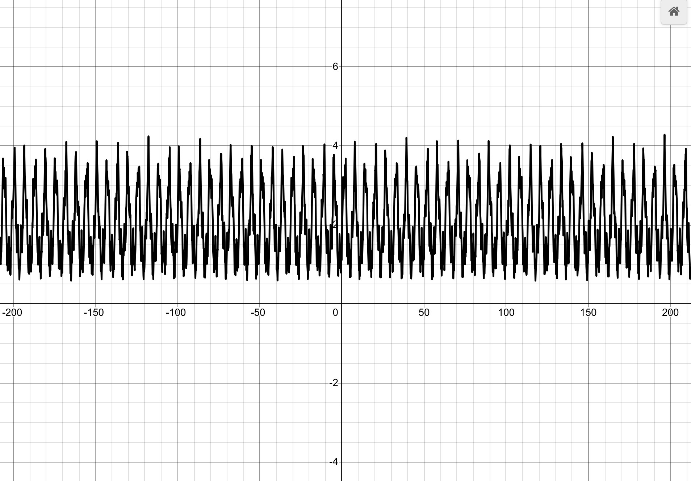
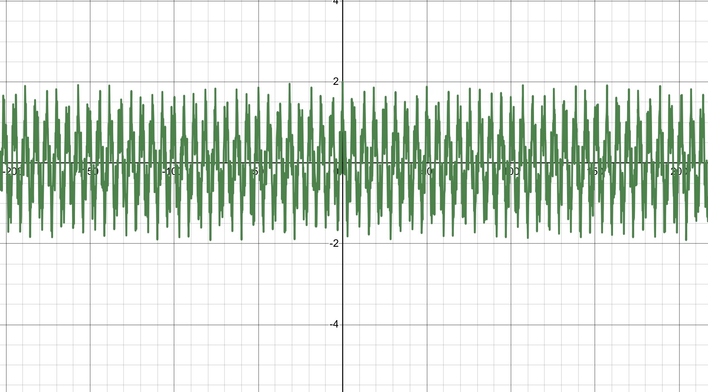

# Fractal Functions Exploration: From Weierstrass to Non-Linear Chaos

An interactive study of fractal functions using Desmos, exploring the mathematical boundaries of continuity, differentiability, and infinite self-similarity.

## 🧐 The Mathematical Problem
In classical calculus, geometric intuition suggests that if a function is continuous everywhere, it must be differentiable (smooth) almost everywhere. In 1872, Karl Weierstrass shocked the mathematical world by constructing the **Weierstrass Function**—a function that is **continuous everywhere but differentiable nowhere**. 

This project explores the specific "recipe" required to build these fractal functions and pushes the concept further by engineering custom, non-linear versions.

---

## 🛠️ The Fractal Recipe Blueprint
Through experimentation in Desmos, I broke down the exact requirements needed to generate a true fractal curve using infinite summation:

$$f(x) = \sum_{n=0}^{\infty} \text{Dampener}(n) \cdot \text{Periodic Wave}(x, n)$$

### The Core Requirements:
1. **The Amplitude Dampener ($a^n$ where $0 < a < 1$):** Ensures that the height of successive layers shrinks exponentially so the infinite series safely converges to a finite, continuous curve instead of exploding to infinity.
2. **The Frequency Booster ($b^n$ where $b > 1$):** Compresses the width of the wave exponentially, forcing each new layer to ripple faster.
3. **The Chaos Rule ($ab > 1$):** Forces the slopes of the microscopic wrinkles to grow steeper faster than their heights shrink, violently shattering differentiability at every scale.

---

## 🚀 The Implementations

### 1. The Classic Weierstrass Function
The standard approach using a smooth, uniform cosine wave:

* **Formula:** `f(x) = \sum_{n=0}^{50} (a^n * \cos(b^n * \pi * x))`
* **Parameters:** `a = 0.5`, `b = 3`

### 2. My Custom Non-Linear Fractal Function
By replacing the standard linear periodic wave with a nested exponential function ($e^{\sin(x)}$), I engineered a non-linear variant that creates highly asymmetric, jagged peaks reminiscent of actual mountain ranges.

* **Formula:** `f(x) = \sum_{n=0}^{50} (a^n * e^{\sin(b^n * x)})`
* **Parameters:** `a = 0.5`, `b = 3.3`

*(Note: When setting $a=1$ or using $e^n$, the amplitude engine explodes because the layers grow larger instead of shrinking, causing the graph to diverge).*

---

## 📊 How to View and Interact
You can instantly visualize these simulations using Desmos:
1. Open [Desmos Graphing Calculator](https://www.desmos.com/calculator).
2. Paste the formula lines and set up sliders for `a` and `b`.
3. Test the **"Zoom-In Test"**—no matter how deeply you magnify the curve, it will reveal an infinite universe of repeating, jagged textures, failing to ever flatten out into a straight line!

my function

Weierstrass Function

